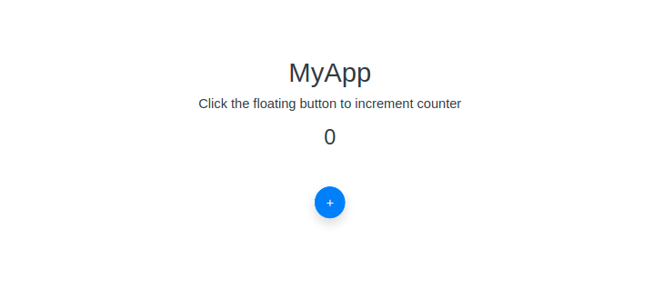

# Bootstrap Page

> A repo to quickly bootstrap a `Page` app.

## Getting started 🚀🚀🚀

> Serve your app

``` bash
# serve with PHP
php -S localhost:8000

# serve with python
python -m SimpleHTTPServer 8000

```

> Open app on browser




> More detailed explanation on how things work would be available soon.<br >Happy Coding 😃